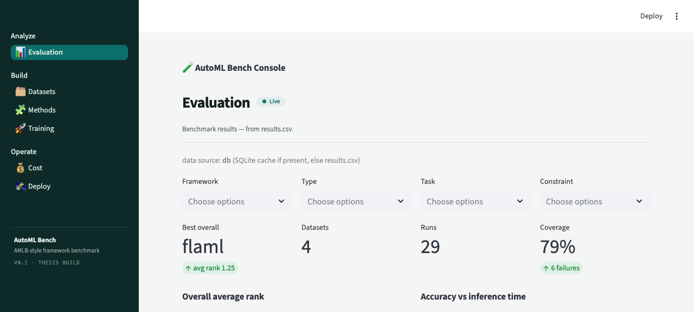
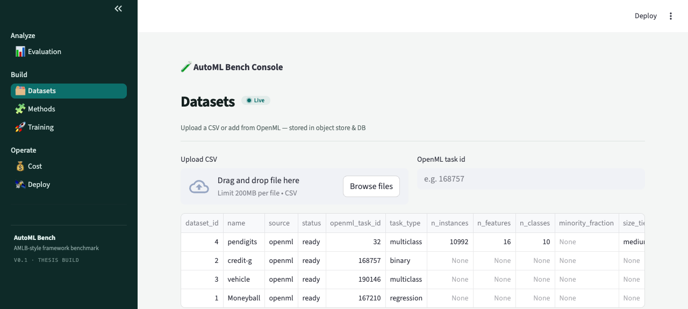
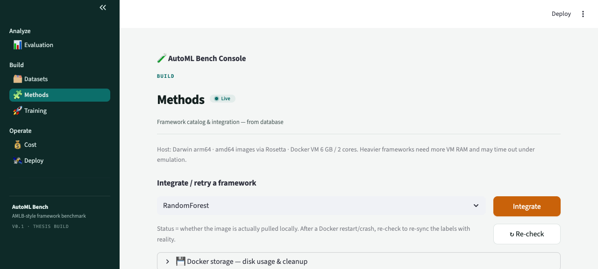
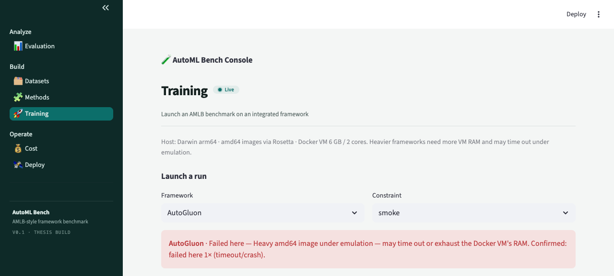

# AutoML Bench Console

A **Streamlit console** for benchmarking AutoML frameworks the AMLB way — fairly, reproducibly,
and on real data. Add datasets, integrate frameworks as Docker images, launch benchmark runs, and
explore the results — all backed by **PostgreSQL** (metadata + results) and **MinIO** (files).

Built on the *[AutoML Benchmark](https://github.com/openml/automlbenchmark)* (Gijsbers et al., JMLR
2024): identical folds / time budgets / metrics / resources across every framework, failures
captured not hidden. The original benchmark spec lives in [`specs/002-automl-benchmark/`](specs/002-automl-benchmark/).



## What it does

- **Datasets** — upload a CSV or add an OpenML task; stored in MinIO + catalogued in Postgres.
- **Methods** — catalog of AutoML frameworks; one-click **Integrate** (`docker pull`); truthful
  status + a per-machine **compatibility** badge; built-in **disk management**.
- **Training** — pick a framework + datasets + budget → a real Dockerized AMLB run → results land
  in the database (with timeout, stop, and auto-reap so jobs never hang).
- **Evaluation** — ranking, accuracy-vs-time Pareto, and by-characteristic views over the results.

## Quickstart

```bash
# 1. Clone + Python env (3.9–3.11)
git clone https://github.com/ThinhSama234/HCMUS-data-mining-AutoML.git automl-thesis
cd automl-thesis && python3 -m venv .venv && source .venv/bin/activate
pip install -r requirements.txt

# 2. Backend: Postgres + MinIO (Docker)
cp .env.example .env
docker-compose up -d

# 3. Seed the catalog (frameworks / datasets / constraints / instances)
python -m storage.seed
# (optional) load a historical results.csv if you have one — a fresh clone ships none,
# so Evaluation starts empty and fills once you run a benchmark on the Training page:
python -m storage.migrate results/results.csv

# 4. Run the console
streamlit run console/app.py                        # → http://localhost:8501

# 5. To run a benchmark (all from the UI — no AMLB install):
#    Methods → Integrate a framework   (this is the `docker pull`)
#    Training → pick datasets + budget → Launch   (this is the `docker run`)
```

> **No `automlbenchmark` clone needed.** AMLB is **bundled inside each `automlbenchmark/<framework>`
> Docker image** — "downloading a framework" = clicking **Integrate** on the Methods page (a
> `docker pull`). You only need Docker, not a local AMLB checkout. (The legacy `scripts/run_mvp.sh`
> *local* mode is the exception — it needs a local AMLB clone + pip-installed frameworks.)
> See [docs/docker.md](docs/docker.md) and [docs/automl-benchmark.md](docs/automl-benchmark.md).

No Docker? Skip steps 2–3 — the app falls back to **SQLite + a local object store**, so browsing,
upload, and OpenML ingest work without containers (only benchmark *runs* need Docker). See
[docs/operations.md](docs/operations.md).

> **Apple Silicon:** AMLB images are amd64. Enable **Rosetta** in Rancher/Docker Desktop
> (`rdctl set --virtual-machine.use-rosetta=true`) — light frameworks (flaml, constantpredictor)
> run; heavy ones (AutoGluon, autosklearn) belong on an x86_64 host. See [docs/docker.md](docs/docker.md).

## Feature tour

**Datasets** — upload CSV / add from OpenML; catalogued with type, source, and status.


**Methods** — framework catalog with integration status, compatibility badges, and Docker storage.


**Training** — launch a real AMLB run on the datasets you pick; watch jobs auto-refresh.


## Documentation

| Doc | What |
|---|---|
| [architecture](docs/architecture.md) | system diagram + training-run data flow |
| [database](docs/database.md) | the 9 tables, ER diagram, how rows get there |
| [object-store](docs/object-store.md) | MinIO/S3, the pointer pattern, local fallback |
| [operations](docs/operations.md) | env vars, bring-up, ports, recovery, tests |
| [docker](docs/docker.md) | framework images, emulation/Rosetta, compatibility, disk |
| [frameworks](docs/frameworks.md) | catalog, integration lifecycle, truthful status |
| [automl-benchmark](docs/automl-benchmark.md) | AMLB, the mvp/smoke suite, scoring |
| [training-and-results](docs/training-and-results.md) | ingest → launch → jobs → Evaluation |

## Layout

```
console/      Streamlit multipage app (app.py + views/)
storage/      DB (models/db/repo/migrate/seed) · objectstore · ingest · integration · runner
analysis/     load_results + ranking/pareto/by-characteristic
amlb_userdir/ AMLB config layer: benchmarks/ (mvp) + constraints.yaml + frameworks.yaml
dashboard/    earlier single-page results explorer (spec 002/003)
tests/        storage / ingest / integration / runner / console-render tests
docs/         this documentation set
specs/        spec-kit specs (002 benchmark, 003 console, 004 docs) — local
```

## Tech stack

Python · Streamlit · SQLAlchemy (PostgreSQL / SQLite) · MinIO (S3, boto3) · Docker + AMLB images ·
OpenML · pandas/plotly. Tests with pytest.

## License

[MIT](LICENSE).
