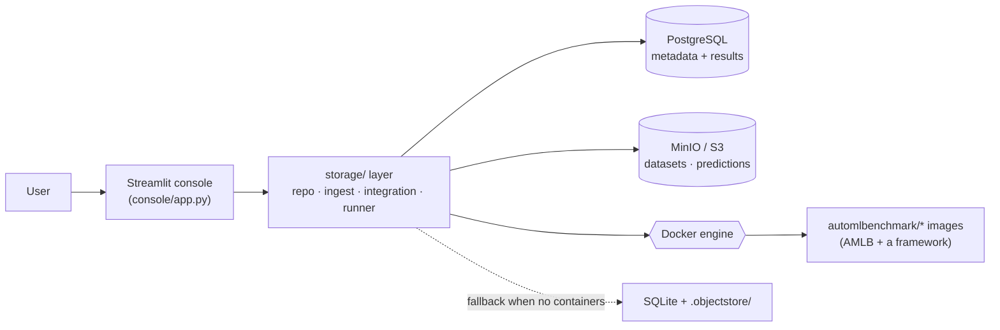

# Architecture

The **AutoML Bench Console** is a Streamlit app over a small backend: PostgreSQL holds metadata
and results, MinIO holds files (datasets, predictions), and the local Docker engine runs the
[AutoML Benchmark (AMLB)](automl-benchmark.md) framework images. There is no API server — the UI
calls the `storage/` layer directly, and long jobs run as **detached `docker` subprocesses** that
write their status back to the database.

## Components



- **console/** — multipage UI (`st.navigation`): Evaluation, Datasets, Methods, Training, Cost, Deploy.
- **storage/** — the only thing that touches the DB/object-store/Docker:
  - `db.py` engine factory, `models.py` schema, `repo.py` read layer, `migrate.py`/`seed.py` ingest.
  - `objectstore.py` MinIO/S3 (or local fallback), `ingest.py` dataset upload/OpenML.
  - `integration.py` pull/manage framework images, `runner.py` launch benchmark jobs.
- **PostgreSQL** — catalog (datasets/methods/constraints) + `runs` (one row per framework×dataset×fold).
- **MinIO** — object store: uploaded CSVs, OpenML parquet, predictions. DB stores only the URI.
- **Docker** — each AutoML framework is a prebuilt `automlbenchmark/<name>` image embedding AMLB.

## Training-run data flow

```mermaid
sequenceDiagram
  participant UI as Console (Training)
  participant RN as storage/runner.py
  participant DK as Docker
  participant DB as PostgreSQL
  UI->>RN: launch(framework, dataset_ids, constraint)
  RN->>DB: insert training_runs(status=running) + links
  RN-->>DK: detached `docker run automlbenchmark/<fw> _job_N <constraint>`
  DK-->>RN: results.csv (per dataset: score, metric, durations)
  RN->>DB: ingest → runs(rows, training_run_id) ; status=done|failed
  UI->>DB: list_jobs() / Evaluation reads runs (auto-refresh)
```

The console polls `list_jobs()`; a job that finishes (or is auto-reaped on timeout) flips status in
the DB and its `runs` rows appear on the **Evaluation** page. See
[training-and-results.md](training-and-results.md).

## Fallback (no containers)

With `DATABASE_URL` and `S3_ENDPOINT` unset, the app runs on **SQLite** (`console.db`) + a local
**`.objectstore/`** directory — useful for dev/tests without Docker. Benchmark *runs* still need
Docker, but browsing/ingesting works. See [operations.md](operations.md).
