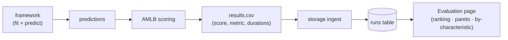

# Using the AutoML Benchmark (AMLB)

This project reuses the official **[AutoML Benchmark](https://github.com/openml/automlbenchmark)**
(AMLB; *Gijsbers et al., JMLR 2024*) as the harness. AMLB enforces **identical folds, time budgets,
metrics, and resources** across every framework on a given task — that's what makes the comparison
fair — and it captures failures instead of silently dropping them.

We don't fork AMLB; we add a thin **config layer** in [`amlb_userdir/`](../amlb_userdir/) and call
the prebuilt framework images (see [docker.md](docker.md)).

## The config layer (`amlb_userdir/`)

`-u amlb_userdir` makes AMLB load our definitions on top of its built-ins:

| File | What |
|---|---|
| `config.yaml` | points AMLB at our benchmarks/constraints/frameworks |
| `benchmarks/mvp.yaml` | the **mvp** suite — 3 OpenML tasks (one per task type) |
| `constraints.yaml` | budgets: **smoke** (60s/1 fold/4 cores), **1h**, **4h** |
| `frameworks.yaml` | framework overrides (empty `{}` — use the images' built-in defs) |

### The `mvp` smoke suite

One small OpenML task per problem type, so a full pass is fast and covers every metric:

| Dataset | Task type | OpenML task | Metric (smoke) |
|---|---|---|---|
| credit-g | binary | 168757 | auc |
| vehicle | multiclass | 190146 | neg_logloss |
| Moneyball | regression | 167210 | neg_rmse |

### Constraints (fair budgets)

| Name | Folds | Budget / fold | Cores |
|---|---|---|---|
| **smoke** | 1 | 60 s | 4 |
| 1h | 10 | 3600 s | 8 |
| 4h | 10 | 14400 s | 8 |

## How a run becomes results

A framework only produces **predictions**; AMLB scores them and writes a row per task×fold:

In this console you don't run AMLB by hand — the **Training** page launches it in Docker on the
datasets you pick and ingests the resulting `results.csv` into the `runs` table. See
[training-and-results.md](training-and-results.md).

> The original benchmark spec (datasets, fairness rules, citation) lives in `specs/002-automl-benchmark/`.
