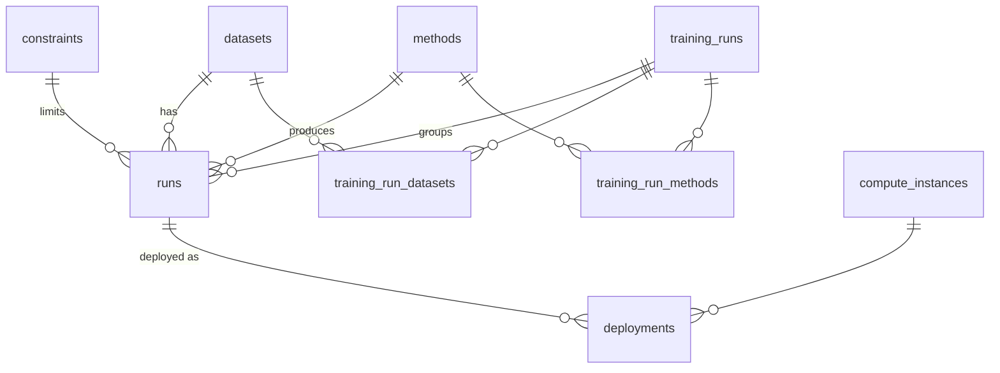

# Database

PostgreSQL (via Docker) is the source of truth for catalog + results; SQLite is the zero-setup
fallback. The schema is defined once in [`storage/models.py`](../storage/models.py) with SQLAlchemy
Core and created on first use by `db.init_db()` — the **same DDL works on Postgres and SQLite**
(`BigInteger().with_variant(Integer(), "sqlite")` for autoincrement PKs).

`DATABASE_URL` selects the backend (see [operations.md](operations.md)). The DB is a *derived*
store — safe to drop and rebuild from the results CSV via `python -m storage.migrate`.

## Tables (9)

| Table | Purpose | Key columns |
|---|---|---|
| **datasets** | every dataset usable in a run | `name`, `source` (import/upload/openml), `openml_task_id`, `task_type`, `target_column`, `storage_uri`, `n_instances`, `status` |
| **methods** | framework/baseline catalog | `name`, `kind` (automl/baseline), `integration_status`, `docker_image`, `image_tag`, `last_integration_at`, `last_error` |
| **constraints** | fair-comparison budgets | `name` (smoke/1h/4h), `folds`, `max_runtime_seconds`, `cores`, `metric_by_type` (JSON) |
| **compute_instances** | cost catalog (Cost page) | `name`, `vcpus`, `memory_gb`, `gpu_type`, `rate_per_hour` |
| **training_runs** | one launched job (batch) | `status` (running/done/failed/cancelled), `constraint_id`, `mode`, `started_at`, `finished_at`, `last_error` |
| **runs** | one result row: framework × dataset × fold | `training_run_id`, `dataset_id`, `method_id`, `constraint_id`, `fold`, `metric`, `result`, `score`, `status`, `training_duration`, `predict_duration`, `metrics` (JSON) |
| **training_run_datasets** | job ↔ datasets (M:N) | `training_run_id`, `dataset_id` |
| **training_run_methods** | job ↔ methods (M:N) | `training_run_id`, `method_id` |
| **deployments** | served model (Deploy page, placeholder) | `run_id`, `instance_id`, `endpoint_url`, `status` |

## Relationships

## How rows get there

- **Catalog** (`methods`/`constraints`/`compute_instances`): `python -m storage.seed` (idempotent upsert).
- **Historical results**: `python -m storage.migrate [results.csv]` rebuilds `runs` from an AMLB CSV (resolves FKs, seeds missing catalog rows). Re-running mirrors the CSV (no dedup).
- **Live runs**: `storage/runner.py` inserts a `training_runs` row + links, then ingests the job's `results.csv` into `runs` tagged with `training_run_id`. See [training-and-results.md](training-and-results.md).
- **Datasets**: `storage/ingest.py` (Upload CSV / OpenML) inserts `datasets` rows. See [object-store.md](object-store.md).

## Read layer

`storage/repo.py` is the single read API used by the console and analysis. `repo.load()` joins
`runs ⋈ datasets ⋈ methods ⋈ constraints` into one tidy DataFrame — **identical columns whether the
source is Postgres, SQLite, or the raw CSV** — so Evaluation works unchanged across backends.
