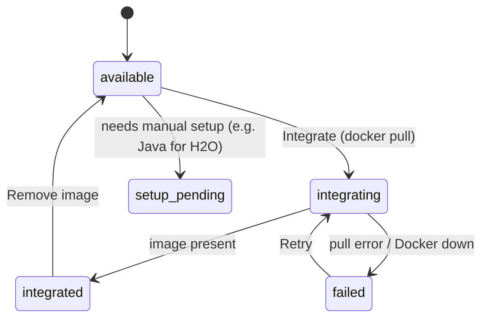

# Frameworks (methods)

A **framework** here is an AutoML system packaged as an `automlbenchmark/<name>` Docker image. The
catalog also includes **baselines** (e.g. `constantpredictor`, `RandomForest`) for reference. Rows
live in the `methods` table ([database.md](database.md)); seeded by `python -m storage.seed`.

## Integration status lifecycle

`methods.integration_status` reflects whether the image is ready to run:

- **available** — known image, not pulled yet.
- **integrating** — `docker pull` in progress (detached worker; the card polls).
- **integrated** — image present locally → runnable on the Training page.
- **failed** — pull failed (e.g. Docker not running) — `last_error` explains.
- **setup_pending** — can't be one-click integrated (manual deps).

## Truthful status (`reconcile`)

The status is just a label; the **truth** is `docker image inspect`. Seed defaults can claim
`integrated` without the image actually being pulled, and a Docker crash can drop images. So:

- `integration.reconcile()` re-syncs every method's status against actual local images
  (present → `integrated`, missing → `available`).
- The Methods page auto-reconciles **once per session**, and a **↻ Re-check** button re-syncs on
  demand (after a Docker restart/crash). The detail page verifies image presence **live**.

## Compatibility on this machine

Each method shows a compatibility badge (see [docker.md](docker.md#compatibility-metric)):
`Runs here` / `Heavy · emulated` / `Failed here` / `Native`. It combines the objective host×weight
prediction with this machine's actual job history. Verified-runnable on an Apple-silicon Mac with
Rosetta: **flaml**, **constantpredictor**.

## Managing an image

From a method's **detail page** (Methods → click a card):

- **Integrate / Retry** — pull the image.
- **🗑 Remove image (free N GB)** — delete the image to reclaim disk; status reconciles to `available`.
- **⏹ Stop job #N** — if a training job is currently running this framework, stop its container.

See [docker.md](docker.md) for emulation, disk, and the run mechanics.
