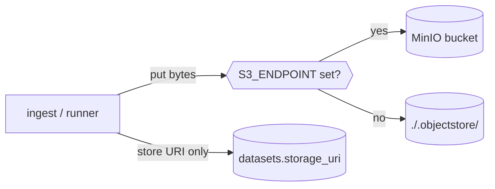

# Object store (MinIO / S3)

Files (uploaded CSVs, OpenML parquet, predictions) live in **MinIO** (S3-compatible). The database
stores only a **URI** (`s3://bucket/key` or `file://…`) — the bytes live in the object store. This
"pointer pattern" keeps the relational DB small and lets large artifacts scale independently.

Implementation: [`storage/objectstore.py`](../storage/objectstore.py).

## Buckets

`datasets` · `predictions` · `models` · `figures` (auto-created on first use via `ensure_buckets()`).

## API

| Function | Does |
|---|---|
| `put(bucket, key, data) -> uri` | store bytes; returns the URI to persist in the DB |
| `get(uri) -> bytes` | fetch by URI (handles both `s3://` and `file://`) |
| `presign(uri, expires=3600)` | a temporary download URL (used by the Datasets table's ⬇ link) |

## Local fallback

If `S3_ENDPOINT` is **unset**, there is no MinIO: `put` writes under `./.objectstore/<bucket>/`
and returns a `file://` URI; `presign` returns the path as-is. So upload/ingest and tests work
with no container running. Set `S3_ENDPOINT` (e.g. via `.env`) to use real MinIO.

## Credentials & console

Defaults match `docker-compose.yml`: key `amlb`, secret `amlb12345`. The MinIO **web console**
is at **http://localhost:9001** (`amlb` / `amlb12345`) to browse uploaded files. The S3 API is on
:9000. These are local-dev defaults — change them (and your `.env`) for any non-local use.

See [operations.md](operations.md) for env vars and [training-and-results.md](training-and-results.md)
for how uploads/OpenML datasets become trainable.
