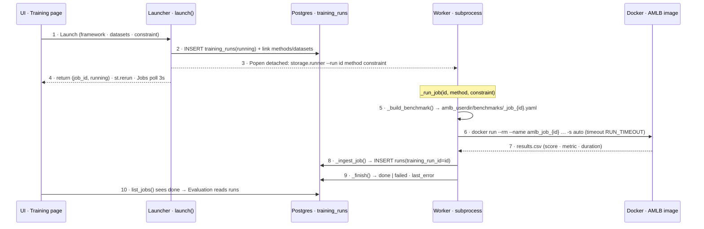

# Training & results

End-to-end: add datasets → launch a benchmark on the ones you pick → watch jobs → read results on
Evaluation.

## Job lifecycle

A "job" is one `training_runs` row, linked to the chosen framework(s) and dataset(s); each scored
result becomes a `runs` row. `launch()` runs in the Streamlit process and returns immediately; the
actual benchmark runs in a **detached worker subprocess** that survives page reloads and reports
back through the database.

Resilience: a run over `AMLB_RUN_TIMEOUT` is `docker kill`ed and marked `failed`; **Stop**
(`cancel()`) kills a running container; a job whose worker died is auto-failed by
`reap_stale_jobs()` on the next Jobs poll. Each job gets its own `_job_{id}.yaml` + `results/job_{id}/`
output dir, so jobs are isolated and debuggable (read `results/job_{id}/run.log`).

## 1. Add datasets (Datasets page)

`storage/ingest.py` → object store + a `datasets` row ([object-store.md](object-store.md)):

- **Upload CSV** — `ingest_upload()`: stores the file, infers `task_type`/`target_column`/counts.
- **Add from OpenML** — `ingest_openml(task_id)`: fetches the task, stores it as parquet, records `openml_task_id`.

A dataset is **trainable** when it has an OpenML task id, or an uploaded file + target column.

## 2. Launch a run (Training page)

`storage/runner.py`:

1. Pick an **integrated** framework + a **constraint** + which **datasets** to train on.
2. `launch()` inserts a `training_runs` row (`status=running`) + `training_run_datasets` links, then
   spawns a **detached** `docker run` worker.
3. `_build_benchmark()` generates an AMLB benchmark file for exactly those datasets:
   - OpenML dataset → `{name, openml_task_id}`.
   - Upload → downloaded from the object store, **train/test split** (AMLB needs both), staged under
     `{user}/data/_job_{id}/`, emitted as `dataset: {train, test, target}`.
4. The worker runs the image (see [docker.md](docker.md)), then ingests the job's `results.csv` into
   `runs` (tagged with `training_run_id`) and sets `status=done|failed`.

The run plan (datasets + budget/folds/cores from the constraint) is shown before you launch, so it's
not a black box.

## 3. Watch jobs

The **Jobs** table auto-refreshes (3s) while anything runs. Per job: framework, constraint, status,
#datasets, #runs, started, duration. Robustness:

- **Stop** — kills a running job's container immediately (`cancel()`).
- **Timeout** — a run over `AMLB_RUN_TIMEOUT` is killed and marked `failed` (never hangs).
- **Auto-reap** — a `running` job whose worker died is auto-failed on next load (`reap_stale_jobs()`).
- **Failure reason** — failed jobs show `last_error` in an expander.

## 4. Read results (Evaluation page)

`runs` flow into the **Evaluation** page via `storage/repo.py` (`repo.load()` → tidy frame). Three
views:

- **Ranking** — frameworks by score per task/metric.
- **Pareto** — accuracy vs. training time trade-off.
- **By characteristic** — performance across dataset traits (size/dimensionality/class balance).

Because `repo.load()` returns the same columns from Postgres, SQLite, or the raw CSV, Evaluation is
unchanged across backends. See [database.md](database.md) and [automl-benchmark.md](automl-benchmark.md).
