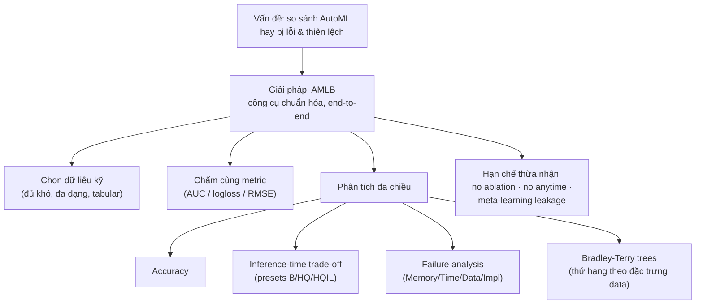

# AMLB: Dịch & Giải thích các đoạn trọng tâm

> Nguồn: Gijsbers et al., *AMLB: an AutoML Benchmark*, arXiv:2207.12560v2.
> Mỗi mục gồm: **📖 Dịch** (sát ý) + **💡 Giải thích** (vì sao quan trọng).

---

## 0. Ghi chú của bạn (tổng hợp trước khi vào paper)

Trước khi vào paper, các ý bạn note lại đã đúng hướng — tóm gọn:

- **AutoML cần nhiều tham số hơn** so với ML thường: ví dụ auto-sklearn có `time_left_for_this_task`, `per_run_time_limit`, `ensemble_size` → tức là ngoài "chọn model" còn phải cấu hình *ngân sách thời gian* và *cách gộp ensemble*.
- Vì nhiều công đoạn → cần **API tích hợp đơn giản**, đặt *time limit*, dùng *ensemble learning*, hỗ trợ cả *classification & regression*.
- **Best practice**: làm sạch/tiền xử lý dữ liệu *trước* khi đưa vào AutoML → đặt ràng buộc thời gian → giám sát tài nguyên tính toán → validate → review model.
- **Khi nào AutoML thành công?** Đánh giá trên 4 trục: *Performance* (accuracy, CV score, ROC/AUC), *Time* (tự động hóa việc lặp lại), *Resources* (tối ưu bộ nhớ, chi phí), *Business* (ROI).
- **Tương lai**: continuous learning, NAS nâng cao, edge computing, automated feature engineering.

→ Paper AMLB chính là công cụ **đo lường một cách chuẩn hóa** đúng các trục Performance / Time / Resources / Failures này.

---

## 1. Mục tiêu của paper (Objective)

**📖 Dịch:**
> "Chúng tôi giới thiệu một benchmark AutoML mới tuân theo best-practices để tránh các sai lầm phổ biến, đồng thời thúc đẩy tiến tới việc benchmark chuẩn hóa hơn. Để đảm bảo **khả năng tái lập**, chúng tôi cung cấp một công cụ benchmark mã nguồn mở cho phép tích hợp dễ dàng với các framework AutoML, và thực hiện đánh giá *end-to-end* trên các bộ dữ liệu mở được tuyển chọn kỹ. Trọng tâm của chúng tôi là **dữ liệu dạng bảng (tabular)**. Dữ liệu phi cấu trúc nằm ngoài phạm vi vì chúng được giải quyết tốt hơn bằng NAS... Chúng tôi cũng chỉ giới hạn ở các framework AutoML mã nguồn mở."

**💡 Giải thích:**
Đây là *scope statement* — 3 ranh giới quan trọng cần nhớ khi đọc/viết luận văn:
1. **Chỉ tabular data** (bỏ ảnh/text thô → đó là địa hạt của NAS/deep learning).
2. **Chỉ open-source frameworks** (để tái lập & kiểm soát cấu hình).
3. **End-to-end + reproducible**: công cụ tự lo từ cài đặt → chạy → chấm điểm, nên người khác chạy lại ra cùng kết quả.

---

## 2. Presets của AutoGluon & cơ chế ensemble 3 tầng

**📖 Dịch:**
> "Ensemble của AUTOGLUON gồm **ba tầng**. Tầng 1 là các model từ nhiều họ model khác nhau, huấn luyện trực tiếp trên dữ liệu. Tầng 2 dùng cùng loại model nhưng như một *stacking learner*, huấn luyện trên cả dữ liệu gốc **và** dự đoán của tầng 1. Tầng cuối gộp dự đoán của tầng 2 thành một ensemble (phương pháp của Caruana 2004, lần đầu dùng trong AutoML bởi AUTO-SKLEARN). Để tuân thủ ràng buộc thời gian, AUTOGLUON có thể dừng sớm hoặc bỏ qua một số model. Nếu có thêm thời gian, nó huấn luyện thêm model trên các *data split* khác nhau để cải thiện tính tổng quát. AUTOGLUON có nhiều preset đánh đổi giữa hiệu năng và *inference time*: chúng tôi đánh giá 3 preset — **best quality, high quality, và high quality với giới hạn inference time** (ký hiệu B, HQ, HQIL). Các preset này cho model ngày càng nhanh hơn nhưng đổi lại độ chính xác giảm."

**💡 Giải thích:**
- **Stacking 3 tầng**: đây là điểm khiến AutoGluon mạnh — nó không tìm kiếm pipeline như các tool khác, mà *gộp* nhiều model theo tầng (tầng sau học từ dự đoán của tầng trước).
- **B / HQ / HQIL** = trục đánh đổi **accuracy ↔ tốc độ dự đoán**. HQIL cố ý làm model nhẹ để phục vụ khi *inference time* quan trọng (ví dụ deploy real-time). Chính vì có preset này mà paper mới phân tích được "trade-off với inference time" — một trong các đóng góp chính.

---

## 3. Post-processor (bộ hậu xử lý của công cụ)

**📖 Dịch:**
> "...một *post-processor* chịu trách nhiệm thu thập & định dạng các dự đoán mà framework trả về, xử lý lỗi, và tính các chỉ số chấm điểm trước khi ghi ra file thông tin cần cho phân tích sau này."

**💡 Giải thích:**
Đây là mô tả kiến trúc công cụ AMLB. Ý quan trọng: việc **chấm điểm được tách khỏi framework** — công cụ tự tính metric từ *predictions thô*, nên mọi framework được chấm bằng **cùng một thước đo**, tránh chuyện mỗi tool tự báo cáo metric khác nhau (đúng lỗi mà Balaji & Allen 2018 mắc phải). Việc "xử lý lỗi" ở đây cũng là nền cho phần *failure analysis*.

---

## 4. Tiêu chí chọn dữ liệu (5.1.1)

**📖 Dịch (rút gọn 4 tiêu chí):**
> Hai suite: **71 classification + 33 regression**, chọn từ paper AutoML trước, các cuộc thi, và ML benchmark, theo tiêu chí:
> 1. **Đủ khó** — nếu bài toán dễ (random forest/decision tree/logistic regression đạt lỗi ~0), nó không phân biệt được các framework.
> 2. **Đại diện bài toán thực tế** — hạn chế bài toán nhân tạo; hạn chế ảnh raw-pixel (nên dùng deep learning riêng) nhưng không loại hẳn.
> 3. **Không có text tự do** không diễn giải được như categorical — vì đa số framework chưa hỗ trợ feature engineering trên text.
> 4. **Đa dạng lĩnh vực** — không để benchmark lệch về một domain (ví dụ không lấy hết các bài software-quality trong OpenML-CC18).

**💡 Giải thích:**
Đây là cách paper **chống selection bias** (lỗi lớn nhất họ phê phán ở phần related work). Ý cốt lõi:
- **"Đủ khó"** là tiêu chí then chốt: benchmark chỉ có giá trị khi các dataset *tạo ra khác biệt* giữa framework. Dataset dễ = mọi tool bằng nhau = vô ích.
- Việc loại text & hạn chế ảnh raw-pixel khớp với *scope* "chỉ tabular" ở mục 1.

---

## 5. Metric đánh giá

**📖 Dịch:**
> "Chúng tôi dùng **AUC** cho phân loại nhị phân, **log loss** cho phân loại đa lớp, và **RMSE** cho hồi quy. Lý do: các metric này hợp lý, phổ biến, và được hầu hết tool hỗ trợ — điều này rất quan trọng vì **AutoML bắt buộc phải tối ưu đúng metric mà nó bị đánh giá**. Model **không được calibrate** trừ khi framework tự làm mặc định..."

**💡 Giải thích:**
- Câu then chốt: *"phải tối ưu đúng metric mà nó bị đánh giá"*. Nếu chấm bằng AUC nhưng để tool tối ưu accuracy → so sánh vô nghĩa (đây chính là lỗi H2O trong Balaji & Allen 2018).
- **Chọn metric theo "mẫu số chung"**: chọn metric mà *mọi* tool đều hỗ trợ, để công bằng. Đánh đổi: bỏ qua calibration (vì đa số tool không hỗ trợ).

---

## 6. Giới hạn thiết kế (5.3.1) — RẤT quan trọng cho phần "Limitations"

**📖 Dịch (3 giới hạn):**
> 1. **Không thể quy hiệu năng về từng thành phần thiết kế** (không làm ablation được). Chênh lệch giữa AUTO-SKLEARN và TPOT có thể do stacking, ensemble, BO vs genetic programming, cách đa tiến trình... hoặc kết hợp. Muốn kết luận được phải *tái cài đặt* mọi framework trên nền chung — nhưng khi đó nó không còn giống phần mềm dùng thực tế nữa.
> 2. **Chỉ ghi kết quả của model cuối cùng.** Không có *anytime performance* (hiệu năng theo thời gian trong lúc tối ưu) → không phân biệt được tool hội tụ nhanh vs chậm. Họ chỉ *xấp xỉ* bằng cách chạy 2 mốc thời gian (1 giờ & 4 giờ).
> 3. **So sánh định tính bị hạn chế**: các "quality of life features" (giải thích pipeline, báo cáo, usability, support) không được đánh giá.

**💡 Giải thích:**
Đây là phần bạn nên trích dẫn khi viết về **hạn chế của benchmark**:
- **Giới hạn 1 (no ablation)** là đánh đổi triết lý: AMLB đo *phần mềm như-nó-được-dùng*, không mổ xẻ từng bộ phận. Đo "cái gì hoạt động tốt trong thực tế" chứ không phải "tại sao".
- **Giới hạn 2 (no anytime)**: chỉ biết điểm cuối, không biết đường đi → nên họ chạy 1h và 4h để *gián tiếp* thấy tốc độ hội tụ.

---

## 7. Meta-learning (5.3.3) — cảnh báo về AUTO-SKLEARN 2

**📖 Dịch:**
> "Nhiều framework dùng *meta-learning* để khởi tạo & tăng tốc tìm kiếm. Vì mọi dữ liệu trong benchmark đều công khai và nổi tiếng, **rất có thể có sự trùng lặp** giữa dữ liệu mà nhà phát triển dùng để meta-learning và dữ liệu trong benchmark. AUTO-SKLEARN có thể *loại trừ dataset theo tên* → AMLB dùng tính năng này để đảm bảo không trùng với 39 dataset của Gijsbers 2019. Nhưng AUTO-SKLEARN 2 thì **không thể loại trừ từng dataset** (meta-model xây trên hàng trăm dataset)... Do đó kết quả của AUTO-SKLEARN 2 **phải được xem xét rất thận trọng và có khả năng lạc quan thái quá (optimistic)**, vì meta-model của nó được xây bằng thông tin của nhiều dataset trong benchmark này."

**💡 Giải thích:**
Đây là dạng **data leakage** ở cấp benchmark: nếu tool đã "học" trên chính dataset dùng để chấm nó → điểm cao một cách không công bằng.
- AUTO-SKLEARN 1: *loại được* dataset trùng → công bằng.
- AUTO-SKLEARN 2: *không loại được* → điểm của nó cao "ảo", đọc kết quả phải trừ hao.
Bài học: khi so sánh AutoML dùng meta-learning, phải kiểm tra **overlap dữ liệu** — nếu không, benchmark bị nhiễm.

---

## 8. Bradley-Terry Trees (6.2) — công cụ phân tích thống kê

**📖 Dịch:**
> "**Cây Bradley-Terry (BT)** dùng để phân tích thống kê thí nghiệm benchmark dựa trên *đặc trưng của dataset* (số mẫu, số feature, tỉ lệ missing value...). Cây dùng các đặc trưng này để **chia** các so sánh hiệu năng theo cặp giữa các framework, nhằm tìm ra khác biệt hiệu năng *có ý nghĩa thống kê*. Mô hình BT xuất phát từ tâm lý học (phân tích thí nghiệm so sánh cặp — chủ thể thích kích thích A hơn B). Với benchmark, xếp hạng "ưa thích" được suy ra bằng **so sánh cặp** hiệu năng của tất cả framework trên từng dataset & fold. Ở mỗi nút chia, một mô hình BT được fit; nếu kiểm định cho thấy *tham số bất ổn định* theo một đặc trưng → nút tách theo đặc trưng có bất ổn định cao nhất (p-value thấp nhất). Lặp lại đến khi hết bất ổn, đạt độ sâu, hoặc lá quá ít quan sát."

**💡 Giải thích:**
Ý tưởng đơn giản hóa: thay vì hỏi *"tool nào tốt nhất nói chung?"*, BT tree hỏi *"tool nào tốt nhất TÙY THEO loại dataset?"*.
- Coi mỗi cặp framework như một trận đấu "A thắng B trên dataset này" (giống xếp hạng cờ vua/thể thao).
- Cây tự động **tách nhóm dataset** theo đặc điểm (vd: "khi >10.000 mẫu → AutoGluon thắng; khi ít mẫu → auto-sklearn thắng").
- Đây chính là cách paper thực hiện đóng góp *"tìm subset tác vụ nơi thứ hạng thay đổi"*.

---

## 9. Các lỗi AutoML quan sát được (6.4) + Phụ lục D

**📖 Dịch:**
> Phân loại lỗi thành 4 nhóm:
> - **Memory**: crash do vượt bộ nhớ / segmentation fault.
> - **Time**: vượt giới hạn thời gian quá mức cho phép.
> - **Data**: lỗi do đặc điểm dữ liệu (vd dữ liệu mất cân bằng).
> - **Implementation**: bug trong code của framework.
>
> (Phụ lục D) Khi **tăng ngân sách thời gian** (1h → 4h): lỗi *memory* và *timeout* **tăng**, nhưng lỗi *implementation* **giảm** → tổng lỗi giảm. Giả thuyết: ở mốc 1h, framework hủy tối ưu sớm để kịp giờ nhưng **chưa kịp tạo model dự đoán**; với 4h nó có thể lùi về dùng model đã tối ưu → ít lỗi implementation hơn.

**💡 Giải thích:**
- Việc **phân loại lỗi 4 nhóm** là nền cho *failure analysis* — một đóng góp chính. Thông điệp: đánh giá AutoML *bắt buộc phải tính cả thất bại*, nếu không một tool "trông có vẻ tốt" chỉ vì nó bỏ qua các dataset khó (đúng phê phán với Truong 2019).
- **Nghịch lý thời gian**: nhiều thời gian hơn → ít lỗi *code* hơn (vì có model dự phòng) nhưng nhiều lỗi *tài nguyên* hơn (chạy lâu → ngốn RAM, dễ quá giờ).

### 9.1 Class Imbalance (Phụ lục D.1)

**📖 Dịch:**
> Hai dataset nhỏ nhưng lỗi nhiều là **'yeast'** và **'wine-quality-white'**, có lớp thiểu số chỉ **5 mẫu**. Trong 10-fold CV, mỗi train split chỉ có 4–5 mẫu của lớp đó. Lỗi *chỉ* xảy ra khi một trong các mẫu hiếm này rơi vào *test set*. Thông báo lỗi khác nhau tùy framework nhưng đều cho thấy việc *đánh giá pipeline thất bại* — nhiều khả năng do dùng **5-fold CV mặc định bên trong**. Lỗi này chỉ thấy ở **GAMA, LightAutoML, và TPOT**.

**💡 Giải thích:**
Đây là ví dụ cụ thể của lỗi nhóm **Data**: khi lớp thiểu số quá ít (5 mẫu), việc lồng CV (10-fold bên ngoài + 5-fold bên trong tool) khiến *có fold không còn mẫu nào của lớp hiếm* → pipeline sập. Bài học thực tế: **imbalance cực đoan + nested CV = điểm gãy**; và lỗi này *phụ thuộc framework* (chỉ 3 tool mắc), cho thấy độ bền xử lý edge-case khác nhau giữa các tool.

---

## 10. Tổng kết mạch logic

**Sợi chỉ đỏ:** các đoạn bạn chọn đều xoay quanh một câu hỏi — *"làm sao so sánh AutoML một cách CÔNG BẰNG và CÓ Ý NGHĨA?"*. Chọn data đủ khó (mục 4), chấm đúng metric (mục 5), tính cả thất bại (mục 9), cảnh giác leakage (mục 7), và thừa nhận cái mình *không* đo được (mục 6).
